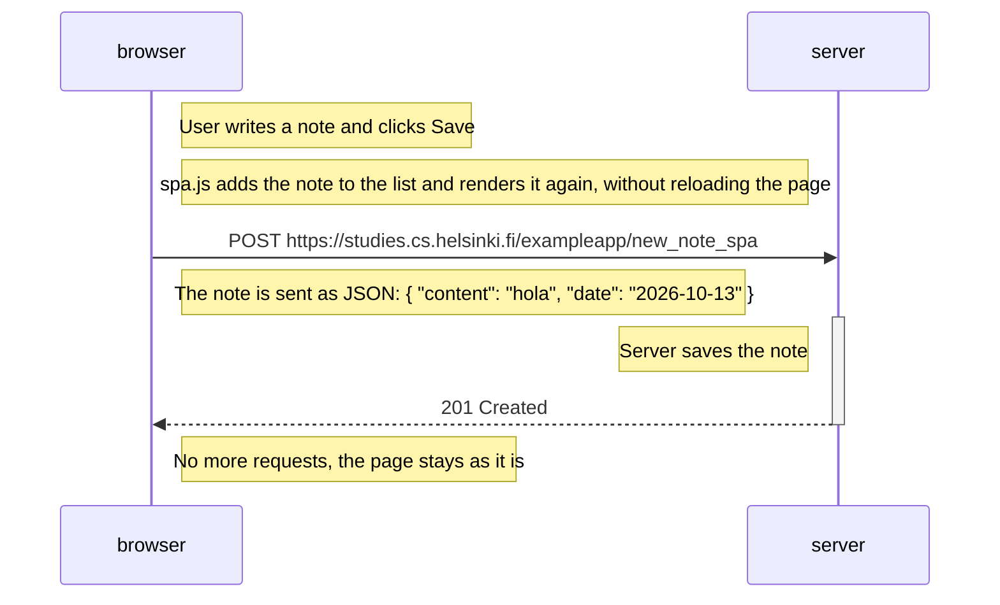

```mermaid
sequenceDiagram
    participant browser
    participant server

    Note right of browser: User writes a note and clicks Save
    Note right of browser: spa.js adds the note to the list and renders it again, without reloading the page

    browser->>server: POST https://studies.cs.helsinki.fi/exampleapp/new_note_spa
    Note right of browser: The note is sent as JSON: { "content": "hola", "date": "2026-10-13" }
    activate server
    Note left of server: Server saves the note
    server-->>browser: 201 Created
    deactivate server

    Note right of browser: No more requests, the page stays as it is
```